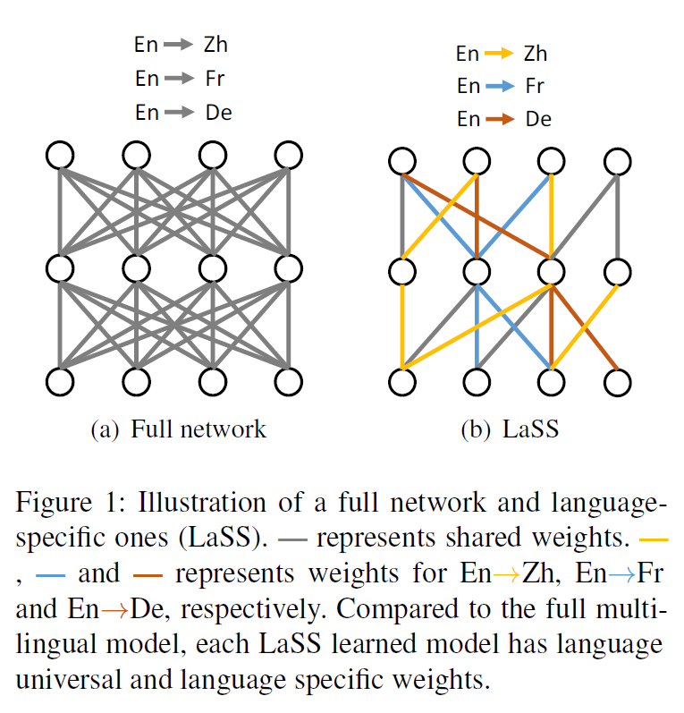
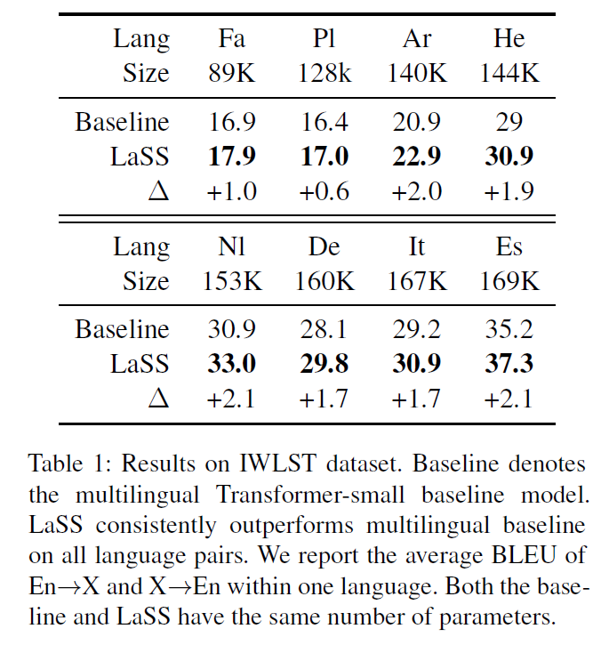
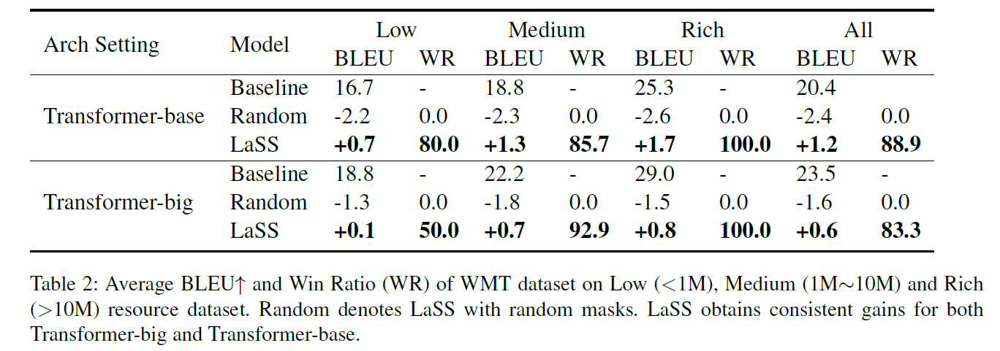
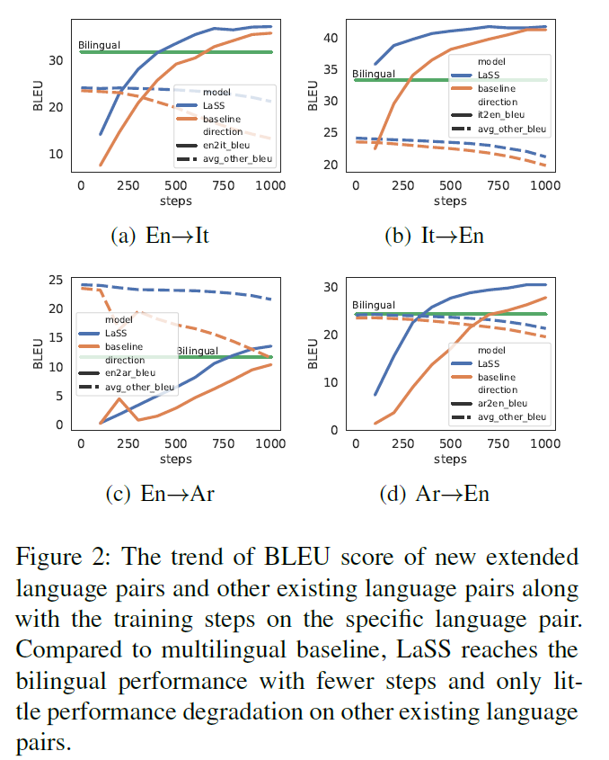

Multiligual machine translation aims at learning a single tanslation model for multiple languages. However, high resource language often suffers from performance degradation. 
In this blog, we present a  method  LaSS proposed in a recent ACL paper on multilingual neural machine translation. 
The LaSS is an approach to jointly train a single unified multilingual MT model and learns language-specific subnetwork for each language pair. Authors conducted experiments on IWSLT and WMT datasets with various Transformer architectures. The experimental results demonstrates average 1.2 BLEU improvements on 36 language pairs. LaSS shows strong generalization capabilty and demonstrates strong performance in zero-shot translation. Specifically, LaSS achieves 8.3 BLEU on 30 language pairs.

<!-- more -->

# Background and motivation
Recent research has forcused on the efficicacy of multilingual NMT, which supports translation from multiple source languages into multiple target languages with a single unified network. The parameter sharing of multilingual Machine Translation model encourages or enforce the parameter sharing between different languages. To demonstrate an extreme case - direct translation between a language pair never seen during the training.

The main challenge for the many-to-many multilingual machine translation is the insufficient model capacity. Since all the translation directions need to be learned in a single model, the model is forced to split out for different language pairs. In this case, rich resource language especially will suffer from the performance degradation. One may consider to enhance the model size to solve the issue. However, larger model size will accompany to the enlargement of dataset. To stay with the same model parameters, an alternatvie solution is to design language-aware components, for example, language-dependent hidden cells and language-aware layer normalization etc. 

Therefore, to achieve a parameter-efficient network, without external trainable parameters for language-specific features, authors propose a Language Specific Subnetwork for multilingual NMT (LaSS). Each language pair in LaSS contains both language universal and language specific parameters. The network is trained to decide the sharing strategy. In particular, LaSS can model the language specific and language universal features for each language direction without interference.  

# Model and details
Overall idea for LaSS is to find sub-networks corresponding to each language pair and only updates the parameters of those sub-networks during the joint training (See Figure 1 for illustration). 
Authors adopt the multilingual Transformer as the backbone network. They train an initial multilingual MT model with the following loss:

<x, y> is a language pair from s to t. theta is the model parameter. 

Start from multilingual base, authors try to find a sub-network which is specific to each language pair. Specific algorithm to find the language specific mask is following:

1. Start with a multilingual MT model jointly trained on {Dsi->ti} from i=1 to i=N.
2. Fine-tunning theta on specific language pair si to ti will amplify the magnitude of the important weights and diminish the unimportant weights.
3. Rank the weights in fine-tuned model and prune the lowest alpha percent. The mask Msi->ti is obtained by setting the remaining indices of parameters to be 1.

After getting masks for all the language pairs, authors create random batches of bilingual sentence pairs where each batch contains only samples from one pair. Specifically, a batch Bsi->ti is randomly drawn from the language-specific data Dsi->ti. During the backpropogation step, authors only update the parameters in theta belonging to the subnetworks, which are the Msi->ti obtaiend from the step 3. The parameters are iteratively updated until convergence. 

During the inference, model parameters are used along with the mask Msi->ti. For every given input sentence in language s and a target language t, model only uses parameter theta with 1s indicated by mask Msi->ti to produce the final inference result. 

# Experiment results and analysis
The experiments are conducted on IWSLT and WMT benchmarks. For IWSLT, we collect 8 English-centric language pairs from IWSLT2014. They apply byte pair encoding (BPE) to preprocess multilingual sentences, resulting in a vocabulary size of 30k for IWSLT and 64k for WMT. 

LaSS consistently outperforms the multilingual baseline on all language pairs, confirming that using LaSS to alleviate parameter interference can help boost performance. Similarly, LaSS obtains consistent gains over multilingual baseline on WMT for both Transformer-base and Transformer-big. For Transformer-base, LaSS achieves an average improvement of 1.2 BLEU on 36 language pairs. For Transformer-large, LaSS obtains 0.6 BLEU improvement. Authors have three key observations: 1) As dataset scale increases, the improvement of BLEU and WR becomes larger, suggesting that the language pairs with large scale benefits more from LaSS. 2)  Transformer-base gains more from the Transformer-big. This verfies the idea that more severe parameter interference for smaller models. 3) Authors also tested on random initialized masks, which is underperformed compared to the baselines. LaSS performance in IWLST and WMT compared to baseline and random initialized masks are included in Table 1 and Table 2, respectively.

In this work, authors also demonstrate that LaSS can easily adapt to new unseen languages without dramatic drops for other existing languages. They distribute a new sub-network to each new language pair and train the sub-network with the specific language pair for fixed steps. In this way, the new language pair will only update the corresponding parameters and it can alleviate the interference and catastrophic forgetting to other language pairs. As demonstrated in the figure 2, LaSS hardly drops on other language pairs, while the multilingual baseline model dramatically drops by a large margin. LaSS also demonstrates its strong performance in zero-shot machine translation. Since LaSS strengthens its language specific parameters, apart from the language indicator, to the model to translate into the target language. 

In the end, authors further analysized on the mask similarity and language family. They observed that for both En->X and X->En, the mask similarity is positively correlated to the language family similarity. Moreover, authors observed that on both the encoder and decoder side, the model tends to distribute more language specific components on the top and bottom layers rather than the middle ones. For fully-connected layer, the model tends to distribute more language specific capacity on the middle layers for the encoder,
while distribute more language specific capacity in the decoder for the top layers. They also invertigate on how mask can improve zero-shot performance. They observed that replacing the encoder mask with other languages causes only littler performance drop, while replacing the decoder mask causes dramatic performance drop. Therefore, decoder mask is essential of performance improvement. Lastly, they found out for larger dataset, like WMT, a smaller pruning rate is better to keep the model capacity.

# 5. Summary
In this work, authors proposed a framework to learn Language-Specific Sub-network (LaSS) for multilingual NMT. The consistent improvements are observed in both IWSLT and WMT datasets, which prove that LaSS is able to alleviate parameter interference and boost performance. They further demonstrated improved performance in new language pair, zero-shot machine translation. In the end, they included detailed analysis on mask-language family relations, language specific capacity, improved performance of mask over zero-shot MT and parameter choice of pruning parameter.   

Code: <https://github.com/NLP-Playground/LaSS>

# Reference
- Zehui Lin, Liwei Wu, Mingxuan Wang, Lei Li. Learning Language Specific Sub-network for Multilingual Machine Translation. ACL 2021. <https://arxiv.org/abs/2105.09259>

