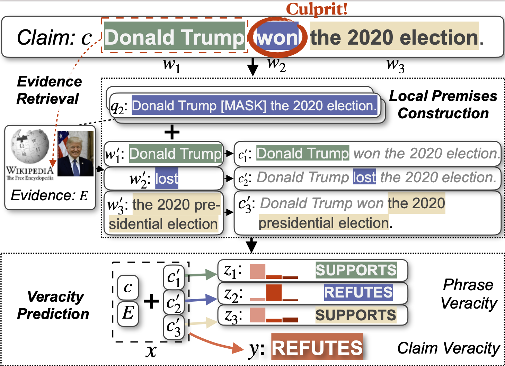
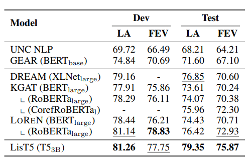
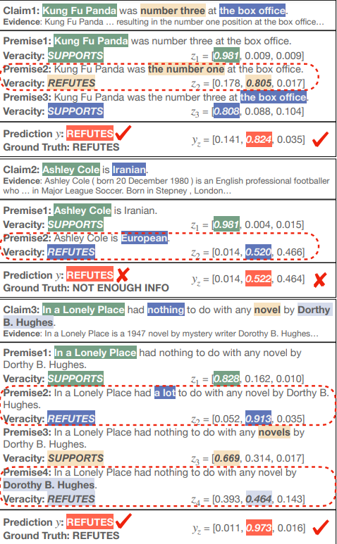
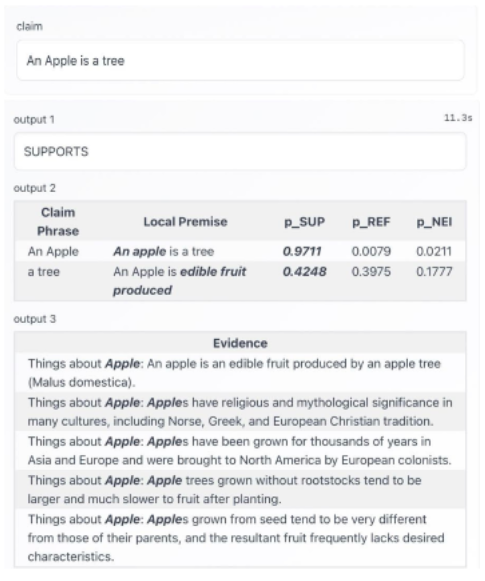

How to develop a model to verify a natural language statement while explaining its rationale?

Reading Time: About 10 minutes.

<!-- more -->

Paper：<https://arxiv.org/abs/2012.13577>

Github: <https://github.com/jiangjiechen/LOREN>

## Introduction

Contemporarily, the widespread use of the internet leads people to be more relying on it as an information
source for news or life tips. However, though the information we get can be reliable the majority of the time,  
it's still inevitable to have some rumors spreading across the internet. For instance, on Feb.7, an article
published by _the Washington Free Beacon_ claimed that "Biden Admin To Fund Crack Pipe Distribution To Advance
‘Racial Equity " [1] while the truth is quite opposite --- Biden didn't fund for crack pipes. How to have models
to detect the truthfulness of these claims? Some studies have developed models on fact verification, but
these models only give you the result of prediction and ignore the importance of providing reasons for that result.
Nonetheless, we should not disregard the essentials of providing rationales for the fact verification result in order
to convince audiences. Aim to solve this issue, the recent paper _LOREN: Logic-Regularized Reasoning
for Interpretable Fact Verification_ [2] introduced the LOREN method that can predict the veracity of a
claim while generating rationales for the result.

In this article, I will introduce the model, LOREN, in three aspects:

1. Explain the LOREN'S architecture.

2. Analyze the performance of LOREN.

3. Possible improvements and potentials of LOREN.

## LOREN'S architecture

Overall, the claim verification process of LOREN is composed of these steps:

1. It decomposes a natural language statement into different phrases.

2. For each phrase, LOREN will generate a probing question and retrieve the corresponding evidence, and then
   it will establish a local premise for that phrase. The process of finding the relevant phrase to generate a local premise is called the machine reading comprehension (MRC) task.

3. Given the probing question, evidence, and local premise, LOREN uses a latent model to first aggregate the veracity of each phrase using soft logic,
   and it distills the knowledge by calculating the probability of the claim being SUP, REF, or NEI (distilling the knowledge)

The purpose of the first two steps is to look for the evidence that supports the phrase-level veracity, and by the mean of soft logic,
which I will introduce later in the article, we can verify the claim and provide reasoning behind it. Here is an example from the original paper that better illustrated the overall idea:

Note that $c_1'$ in the above figure is supposed to be "Joe Biden won the 2020 election". This is the problem in evidence retrival part of LOREN, which I will address it later in the third session.

### Decomposition of the claim

The idea behind the claim decomposition is straightforward: We extract verbs, adjective phrases, noun phrases, and name entities from the claim. To ensure the accuracy of the decomposition, LOREN leverage a part-of-speech (POS) tagger for identifying verbs and a constituency parser to identify noun phrases [2]. To decompose these noun phrases into fine-grained phrases, it further uses POS tagger and name entity recognizer to extract adjective phrases, name entities, and fine-grained noun phrases from the original noun phrases.

### Probing questions generation, evidences retrieval, and local premises construction

Local premises are the collection of information to verify the veracity of each claim. [2] To construct local premises, we need probing questions and evidence as input. Regarding the probing questions, they consist of two sub-questions: one is the cloze question and another is the interrogative question. The cloze question is generated by masking out the phrase in the original claim and the interrogative question is generated by the off-the-shelf question generating model based on the T5 base. For the evidence retrieval part, LOREN first identifies the name entity in the claim, and then it searches for the relevant information from the Wikipedia(Since they used Wikipedia as the evidence retrieval source, it results in the lack of common sense Knowledge of LOREN, which I will discuss in detail in the third session).

With probing questions and evidence, LOREN adopted the generative machine reading comprehension(MRC) model as a sequence-to-sequence model [3]. MRC model is self-supervised and it will generate answers for each phrase and replace the original phrase in the claim to generate our local premises.

### Latent model construction

Before we dive into the detail of latent model, let me introduce the logic constraints that LOREN developed for predicting claim veracity based on the veracity of each phrase.

1. A claim is SUP iff all phrases are SUP
2. A claim is REF iff there's at least one phrase that is REF
3. A claim is NEI iff neither above.

Following the above logic rules, loren further soften these rules into a probability distribution.

1. $q^{T}_{\phi}(y_z = SUP) = \sum_{i=1}^{|z|}q_{\phi}(z = SUP)$
2. $q^{T}_{\phi}(y_z = REF) = 1- \sum_{i=1}^{|z|}(1-q_{\phi}(z = SUP))$
3. $q^{T}_{\phi}(y_z = NEI) = 1-q^{T}_{\phi}(y_z = SUP)-q^{T}_{\phi}(y_z = REF)$

where

1. $y\in{SUP,REF,NEI}$, which is the veracity of a claim.
2. $z_i\in{SUP,REF,NEI}$, which is the latent variable represents the veracity of a phrase.
3. $y_z$, which is the logic aggregation of the latent variable $z$, meaning that $y_z$ is a categorical distribution over three labels ${SUP,REF,NEI}$.

The above aggregation of the soft logic serves to distill the knowldge to $p_{\theta}(y|z,x)$ (Probability of the claim label given the phrase-level label and input x),
which is the probability we eventually want to optimize.

## Experiment

The model is trained on BERT and RoBERTa, and eventually it is evaluated on the dataset FEVER 1.0 shared task that is split into training, development and blind test set.
Before we analyze the experiment result, I will summarize the experiment metrics they used to evaluate the performance[2]:

### Experiment metrics for the performance of the model:

1. Label Accuracy (LA): The accuracy of predicted label for claim regardless of retrieved evidence.
2. FEVER score (FEV): The accuracy of both predicted label and retrieved evidence.

Let's look at the above overall performance of LOREN. We can see from the result that LOREN is either outperforming or comparable with other
baseline method except for LisT5. This is mainly because the PLM for LisT5, which is T5, is larger than BERT and RoBERTa. However, LOREN still outperforms LisT5 on the FEVER score of the development set (dev). To summarize, the performance of LOREN is decent and it has the potential to achieve a better result.

In addition, we will dive into the most important part of the experiment: a case study of the LOREN's interpretability.
For claim one in the above figure, LOREN can detect which phrase is the culprit in the claim, and it's also providing the reasoning that why that phrase is causing the mistake, i.e., replacing the false phrase "the number three" with "the number one". In the third claim, LOREN shows its ability to detect multiple culprit phrases in the claim. However, for the second claim, the predicted result should be NEI. LOREN made this mistake mainly because of the evidence retrieval module and MRC module. First, the evidence retrieval module did not draw the correct evidence, and then the MRC module still replaced the original phrase even though there's no direct evidence given. Here's another example that indicates a drawback of LOREN:

For the phrase "a tree" in the claim, even though LOREN generates the correct local premise based on the evidence, it still considers the label of this phrase as supported. It is because LOREN does not possess commonsense knowledge, and we can see the probability of SUP and REF are very close, indicating that LOREN fails to distinguish "tree" and "edible fruit produced" as two completely different objects.

## Future improvements

possible cause of this problem is that the evidence retrieval module is immature. For this module, LOREN directly adopts the retrieved results of KGAT which relies on the entity linking: sentence ranking pipeline. In other words, LOREN searches the name entity on Wikipedia and selects related sentences (evidence) based on a neural sentence ranking. Since evidence retrieved from Wikipedia is rich in encyclopedic knowledge but poor in commonsense knowledge, LOREN is biased
toward this knowledge. Thus, how to train LOREN to understand common sense knowledge is worth exploring in the future. On the other hand, LOREN does not possess the power to verify the first-order logic claims, such as "All spiders are poisonous" or "There exists an apple that is not edible". Since in this case, if the evidence does not directly imply the correctness of the claim, LOREN may not be able (and it's also computationally inefficient) to search for all spiders to check if there exist some spiders that are not poisonous.

## Conclusion

To verify the veracity of a claim, LOREN first computes the probability of the veracity of each phrase in the claim, and with the soft logics, it further aggregates the corresponding probabilities to predict the correctness of the claim. This method does well in verifying correctness of a claim and providing the related rationales.

## References

[1] Patrick Hauf "Biden Admin To Fund Crack Pipe Distribution To Advance ‘Racial Equity’" _the Washington Free Beacon_, 2022.

[2] Jiangjie Chen, Qiaoben Bao, Changzhi Sun, Xinbo Zhang, Jiaze Chen, Hao Zhou, Yanghua Xiao, and Lei Li.
"LOREN: Logic-Regularized Reasoning for Interpretable Fact Verification", AAAI, 2022
